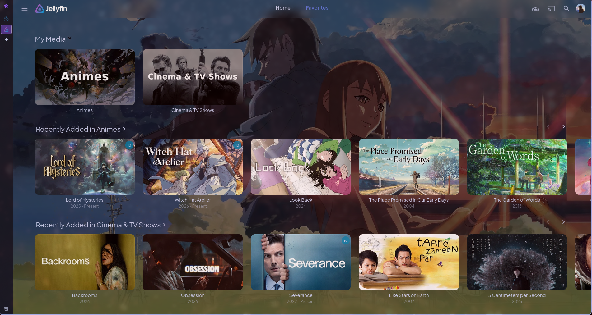
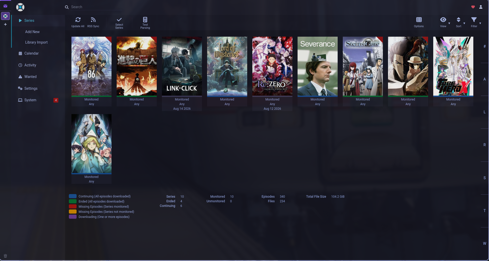
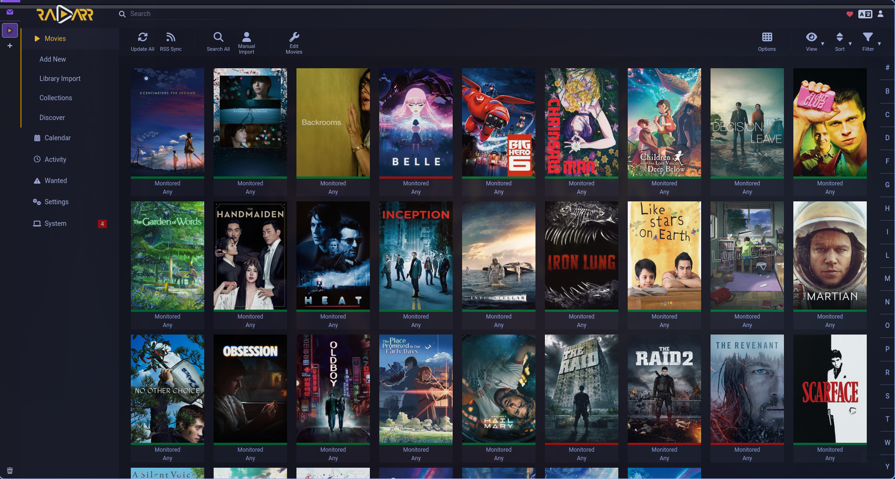
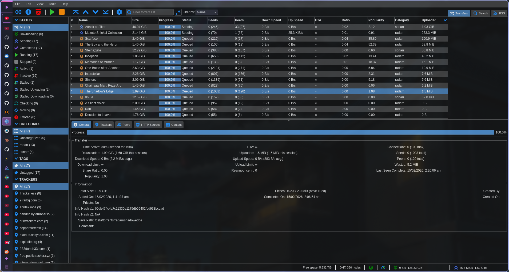

# Apps

This page in the homelab repository is a way to feature all of the apps that I have running

## Table of Contents
* [Home](https://github.com/RuhanShafi/HomeServer/blob/main/README.md)
* [Initial Setup](https://github.com/RuhanShafi/HomeServer/blob/main/initsetup/README.md)
* [Apps](https://github.com/RuhanShafi/HomeServer/blob/main/apps/README.md)
    - [Dashboard](#dashboard)
    - [Tools and Utilities](#tools-and-utilities)
    - [Media Server User Experience](#media-server-front-end)
    - [Media Management](#media-management-back-end)
    - [Download Clients](#download-client)
* [Media](https://github.com/RuhanShafi/HomeServer/blob/main/media/README.md) - Deeper Dive into my Jellyfin & *arr stack setup 

## Categories 

### Dashboard

#### Homarr

**Resources:** [Github]()

### Tools and Utilities

#### File Browser

#### Penpot

Penpot is an open-source design and prototyping tool, similar to Figma, that runs entirely in your browser. It supports vector design, component libraries, interactive prototypes, and team collaboration. Unlike Figma it's self-hosted meaning your design files stay on your own server and there are no subscription costs or seat limits.

### Media Server Front End 

#### Jellyfin

Jellyfin is a fully open-source media server that organises and streams your movie, TV, music, and book libraries to any device on your network or remotely. It transcodes media on the fly if the client can't play the original format, manages metadata like posters and descriptions automatically, and supports multiple user accounts with individual watch histories and parental controls.

#### Jellystat

Jellystat is a Statistics App 

#### Overseerr

### Media Management Back End

#### Sonarr - Manages TV Shows & Animes

Sonarr is a media organization tool for TV Shows. This allows you to scan your library to see everything you have. Manage file names, see the media quality, and even search indexers for media

**Resources:** [Wiki](https://wiki.servarr.com/sonarr) | [Github](https://github.com/Sonarr/Sonarr) | [Website](https://sonarr.tv/)

#### Radarr - Manages Movies of all kind

**Resources:** [Wiki](https://wiki.servarr.com/radarr) | [Github](https://github.com/Radarr/Radarr) | [Website](https://radarr.video/)

#### Bazarr - Manages Subtitles | Particularly helpful for foreign media such as Animes and more

Bazarr is a subtitle manager that integrates with Sonarr and Radarr to automatically download subtitles for your entire media library. It supports dozens of subtitle providers, matches subtitles to the correct language and format, and keeps your library updated as new subtitle translations become available. It can also upgrade existing subtitles if a higher-quality version is found.

**Resources:** [Wiki]() | [Github](https://github.com/morpheus65535/bazarr) | [Website](https://www.bazarr.media/)

#### Prowlarr - Index Manager

**Resources:** [Wiki](https://wiki.servarr.com/prowlarr) | [Github](https://github.com/Prowlarr/Prowlarr) | [Website](https://prowlarr.com/)

### Download Client

#### qBittorrent

This is a docker deployment of the qBittorrent peer-to-peer file sharing client which in my humble option is the best torrent downloader on the market. Can be replaced with Transmitter if that's your preferred torrent software but both integrates well with various *arr applications so its a matter of preference.

**Resources:** [Github](https://github.com/qbittorrent/qBittorrent) | [Website](https://www.qbittorrent.org/)

### DNS and Remote Connections

#### AdGuard

**Resources:** [Github](https://github.com/AdguardTeam/AdGuardHome) | [Website](https://adguard.com/en/adguard-home/overview.html)

